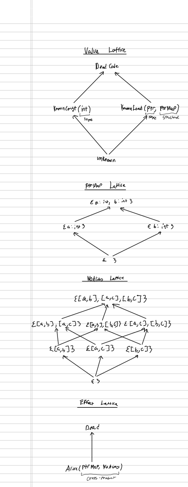

# Known Pointee Analysis

Weeks 5–6 assignment for CS 6475.

To run this analysis, execute `./run.sh`. This will compile the program in `input.cpp` and produce an annotated control-flow graph in `output.txt`. If you have LLVM bytecode available, you can run `cargo run -- path_to_input.ll`.

The existing `output.txt` demonstrates a deduction of `foo` and `bar` not aliasing and, if the call to `arbitrary_side_effect` is commented out from `input.cpp`, the detection of dead-code that LLVM couldn't eliminate (grep for `is_dead: true`).

This analysis works by determining...

- The known scalar value a given SSA term has.
- The known scalar values that the direct pointee of every SSA pointer term has at every statement location.
- The set of SSA pointer terms that cannot possibly alias at every statement location.
- Whether the program is dead at a given statement location since it's very easy to track and can help with some analyses.
- If a scalar value is not known for a given SSA term but that value was obtained by an `llvm.load` operation, it tracks what that SSA term could equal given all possible aliasings of the loaded pointer with other pointers with known values.
- We can use `llvm.cond_br` and these speculative alias guesses to determine which pointers are allowed to alias depending on the branch taken at runtime.

I'm not sure whether our analysis is sound if pointers are allowed to partially alias because...

- The transfer function for `llvm.store` considers two pointers to be non-aliasing if writing to one pointer has no effect on the other non-aliased pointer.
- The transfer function for `llvm.cond_br`, meanwhile, considers two pointers to be non-aliasing using an assumption that some unreachable condition occurs while speculating on reads of other pointers from exclusively their base address.
- This leads to a potential issue where `llvm.cond_br` proves two pointers cannot point to the same base address and `llvm.store` uses that fact to assume that a store to one pointer cannot affect the bytes pointed to by the other pointer.

Luckily, I think this can be taken for granted so long as we only consider aligned `llvm.load`s since, afaict, the operation requires pointers to be aligned to their word size. Then again, I do worry that some architectures might not have as strong an alignment requirement for their loads so maybe I have to track the load size and required alignment of the pointer to be able to properly make that assumption.

This project is written in `pliron` because I didn't really want to define my lattices and their pattern-matching rules in C++. This unfortunately meant that I had to roll my own dataflow framework in `src/dataflow.rs`. The actual analysis for this project is in `src/analysis.rs` and `src/lattice.rs`. It also means that you cannot run this analysis on LLVM bytecode files with 128-bit integers because of a quirk with `pliron`'s LLVM bindings, which includes the bytecode output of the `sqlite3.c` amalgam.

## Notes on Dataflow

This is actually a pessimistic analysis rather than an optimistic one so our lattice orders are actually inverted from what they are usually. This means that knowing more information about a program effect or value should not put you in a scenario where you subsequently learn less.

Here's what our lattices look like...

